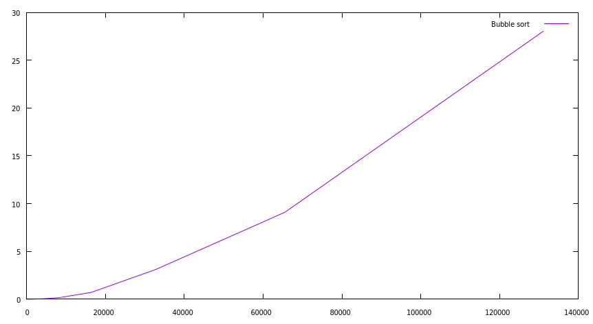
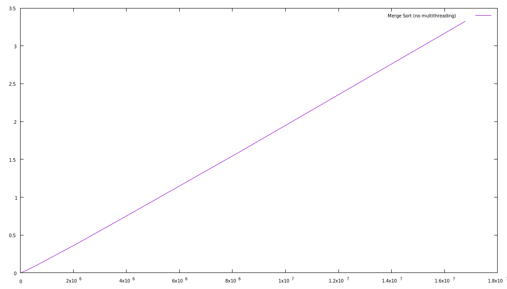
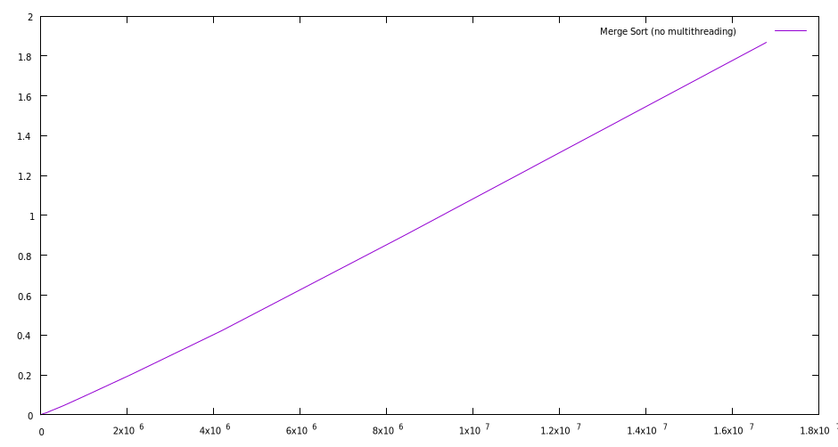
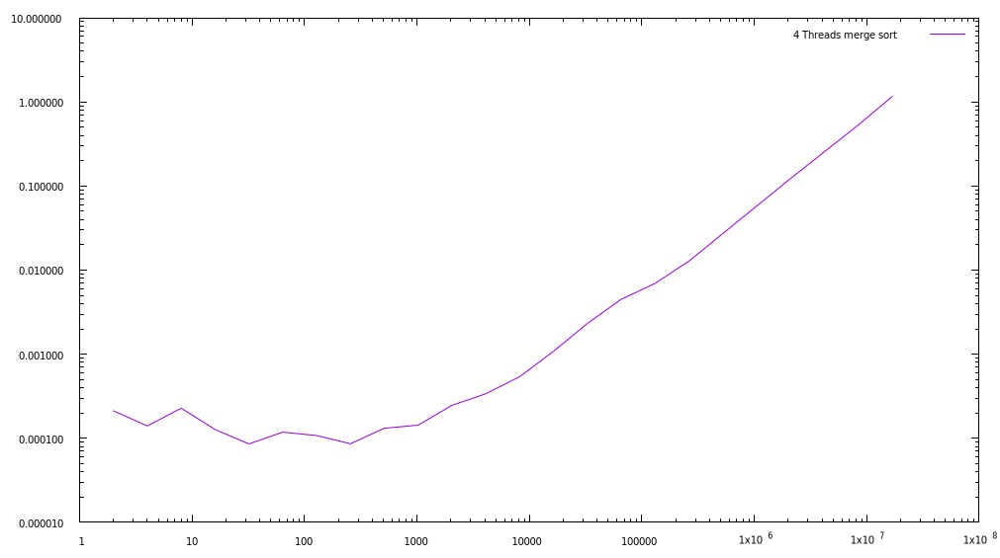
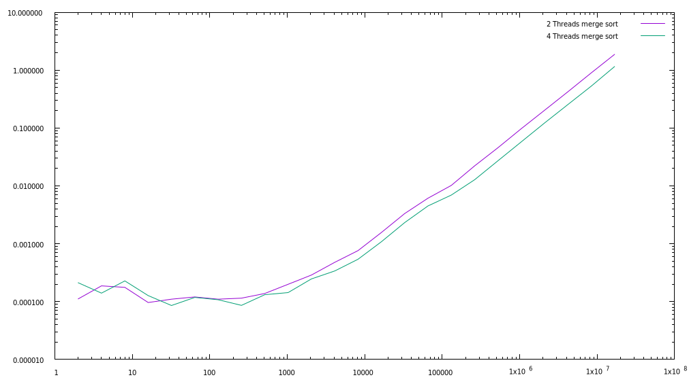

## INFO606-TP1
Antonin Plard

Le sujet : 

### 1 - Tri à bulle

**Question 1:**
Une foit l'algo inplementé. On lance le programme.
On remarque qu'à partir d'un tableau de taille de 2^15 le tri prend plusieurs second à être trier.

**Question 2:**
Courbe avec gnuplot
```Bash
gnuplot> plot "00_bubble_sort.txt" using 1:2 with lines title "Bubble sort"
```



**Question 3**
On voit sur le plot que la courge est bien en n², donc conforme à la compléxiter du bubble sort

**Question 4**
Non, on ne peut pas paralléliser cet algo, car l'opération suivante nécessite la précédente.
Et même si on le parallelise, ça compléxiter est trop mauvais même divisée.

### 2 - Tri fusion

#### 2.1 L'algorithme
En langage naturel
```
fonction triFusion(T: tableau, deb: Nombre, fin: Nombre)
  Si deb < fin:
    mil = deb + (fin - deb ) / 2
    triFusion(T, deb, mid)
    triFusion(T, mid, deb)

    fusion(T, deb,mid, fin)
```

#### 2.2 - L'opération de fusion

**Question 1:**
Implementation dans `merge_sort_1.c`

**Question 2:**


On note bien que la complexiter est O(n log n).

**Question 3:**
On peut calculer l'evolution de la mémoire.
Le tableau principale fait `n x sizeof(int) = 4n` octets.
Puis on alloue deux tableau L et R a chaque fusion.

### 3 - Multithreading

#### 3.1 - Utilisation de deux Threads

**Question 1:**
En divisant la tâche sur deux threads, on note une réelle amélioration des temps.
On le voit bien sur le graphique.



**Question 2:**
 Avec 4 threads on obtient le graphique suivant



Et si l'on compare les deux on voit quant même une amélioration.



#### 3.2 Thread et récursivité


**Question 3:**
Pour un tableau de taille 1024 utiliserait:
2 + 4 + 8 + ... + 2^10 soit 2048 threads !!


**Question 4:**
Lorsque l'on test le programme il tourne normalement jusqu'à 2^15. A ce moment la il tourn dans le vide ?!
On a surement créer trop de threads.

**Question 5:**

**Question 6:**

**Question 7:**


### 4 - Flou gaussien

**Question 1:**

