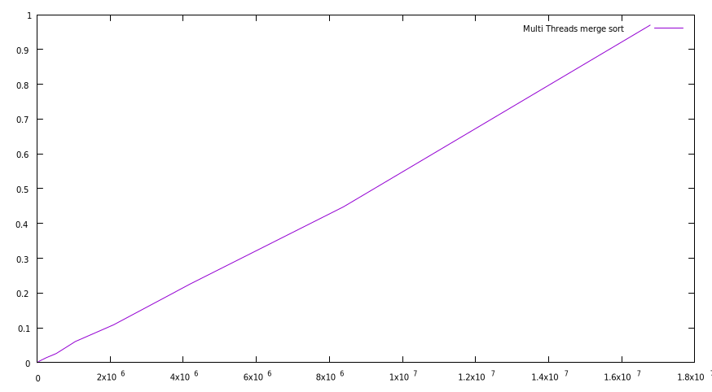
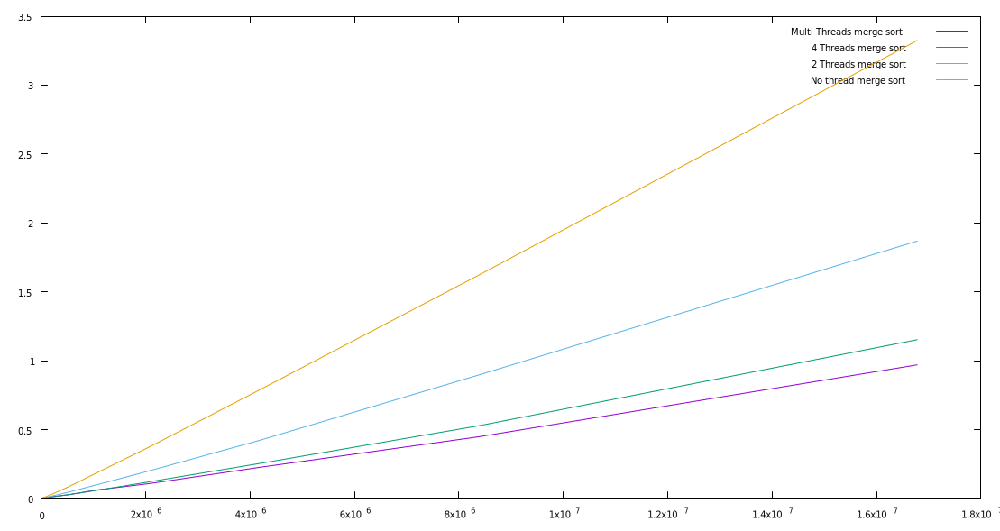

## INFO606-TP1
Antonin Plard

Le sujet : 

### 1 - Tri à bulle

**Question 1:**
Une foit l'algo inplementé. On lance le programme.
On remarque qu'à partir d'un tableau de taille de 2^15 le tri prend plusieurs second à être trier.

**Question 2:**
Courbe avec gnuplot
```Bash
gnuplot> plot "00_bubble_sort.txt" using 1:2 with lines title "Bubble sort"
```


**Question 3**
On voit sur le plot que la courge est bien en n², donc conforme à la compléxiter du bubble sort

**Question 4**
Non, on ne peut pas paralléliser cet algo, car l'opération suivante nécessite la précédente.
Et même si on le parallelise, ça compléxiter est trop mauvais même divisée.

### 2 - Tri fusion

#### 2.1 L'algorithme
En langage naturel
```
fonction triFusion(T: tableau, deb: Nombre, fin: Nombre)
  Si deb < fin:
    mil = deb + (fin - deb ) / 2
    triFusion(T, deb, mid)
    triFusion(T, mid, deb)

    fusion(T, deb,mid, fin)
```

#### 2.2 - L'opération de fusion

**Question 1:**
Implementation dans `merge_sort_1.c`

**Question 2:**


On note bien que la complexiter est O(n log n).

**Question 3:**
On peut calculer l'evolution de la mémoire.
Le tableau principale fait `n x sizeof(int) = 4n` octets.
Puis on alloue deux tableau L et R a chaque fusion.

### 3 - Multithreading

#### 3.1 - Utilisation de deux Threads

**Question 1:**
En divisant la tâche sur deux threads, on note une réelle amélioration des temps.
On le voit bien sur le graphique.


**Question 2:**
 Avec 4 threads on obtient le graphique suivant


Et si l'on compare les deux on voit quant même une amélioration.


#### 3.2 Thread et récursivité


**Question 3:**
Pour un tableau de taille 1024 utiliserait:
2 + 4 + 8 + ... + 2^10 soit 2048 threads !!


**Question 4:**
Lorsque l'on test le programme il tourne normalement jusqu'à 2^15. A ce moment la il tourn dans le vide ?!
On a surement créer trop de threads.

**Question 5:**
On prend en compte la taille du tableau et que l'on définie une valeur de seuil en dessous du quelle
on passe merge non threader.

voici le resulta avec un seuil à 4096.


**Question 6:**
On peut donc conclure que le merge sort multi threader est intairssant sur les tableau de grands tailles.
D'après quelque test au moins à partire de d'un tableau de taille 4096.

**Question 7:**

Voici donc les courbes entre elles. On voit vraiment les gains.



### 4 - Flou gaussien

**Question 1:**

Si l'on compage la version non multi threader et la version multithreader,
on optient un différence.

Ici avec `time`.

*NO THREADS*
```
________________________________________________________
Executed in  807.98 millis    fish           external
   usr time  797.35 millis    0.55 millis  796.79 millis
   sys time    6.24 millis    1.28 millis    4.96 millis
  
```

*4 THREADS*
```
________________________________________________________
Executed in  227.36 millis    fish           external
   usr time  845.82 millis    0.00 millis  845.82 millis
   sys time    7.83 millis    1.87 millis    5.96 millis
```
